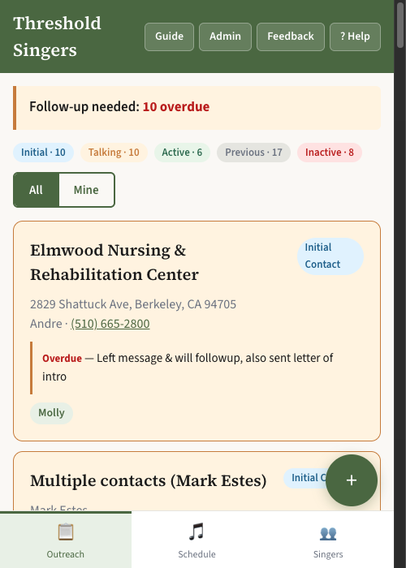
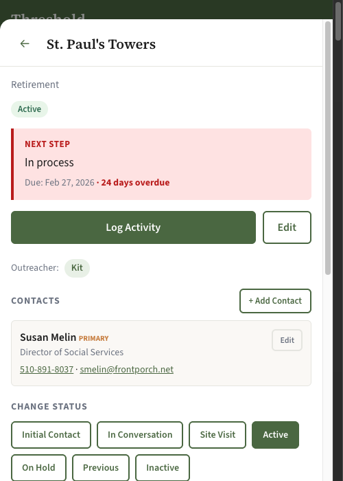
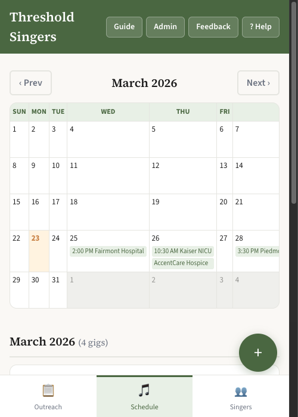
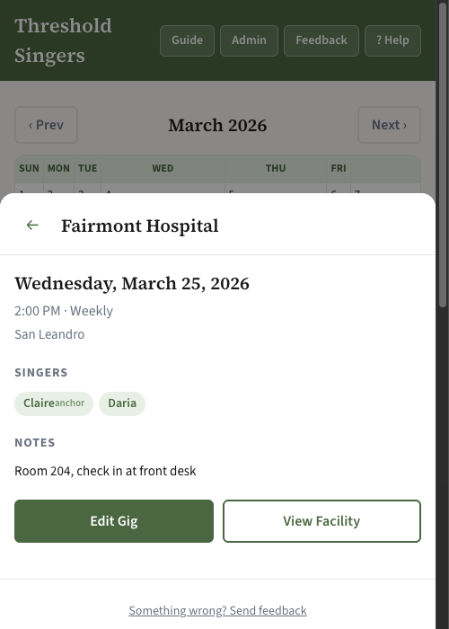
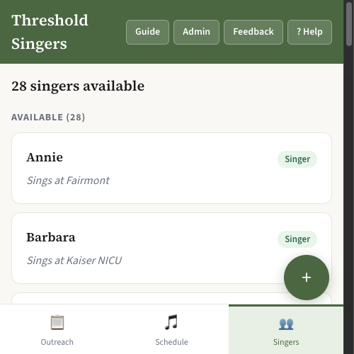

# TSEB User Guide — Threshold Singers East Bay

Welcome! This guide covers everything you need to know to use the Threshold Singers East Bay app. Whether you are brand new to it or just looking for a refresher, you will find it all here. Take your time — you cannot break anything by tapping around and exploring.

---

## Table of Contents

1. [Getting Started](#getting-started)
2. [Outreach Tab](#outreach-tab)
3. [Working with Facilities](#working-with-facilities)
4. [Schedule Tab](#schedule-tab)
5. [Working with Gigs](#working-with-gigs)
6. [Singers Tab](#singers-tab)
7. [Header Buttons](#header-buttons)
8. [Admin View](#admin-view)
9. [Sending Feedback](#sending-feedback)
10. [Quick Reference](#quick-reference)
11. [Index](#index)

---

## Getting Started

**What this app does:** The TSEB app keeps track of all the care facilities we work with, our upcoming singing sessions (called "gigs"), and our roster of volunteer singers — all in one place that anyone in the group can check from their phone.

**How to open it:** Open your phone's browser (Safari, Chrome, or whatever you normally use) and go to:

> **https://jhwright.github.io/TSEB/**

Bookmark that address so you can find it easily next time. Right now, the app is open — no sign-in needed. Just open the link and you are in.

**The three tabs:** At the bottom of the screen you will see three tabs. Tap any one to switch between them:

- **Outreach** — Care facilities we are reaching out to or actively singing at
- **Schedule** — Upcoming (and past) singing sessions
- **Singers** — Our volunteer roster

---

## Outreach Tab

This is the first thing you see when you open the app. It shows all the care facilities we are in contact with, along with helpful filters so you can quickly find what you need.

### Urgent Action Callout

At the very top of the Outreach screen, look for a highlighted notice. If any facilities have a follow-up that is overdue or due this week, you will see a count right there — something like "2 overdue, 1 due this week." That is your nudge to check in with those facilities first.

### Status Filter Pills

Just below the urgent notice, you will see a row of colored pills: **Initial, Talking, Site Visit, Active, Hold, Previous, Inactive.** These let you narrow the list to just one group at a time.

- Tap any pill to filter the list to only facilities with that status
- Tap the same pill again to clear the filter and see everyone
- You can also tap the **"Clear filter"** link that appears when a filter is active

This is especially handy when you only want to look at, say, the facilities you are currently in active conversation with.

### All / Mine Toggle

Near the top of the screen you will see two buttons: **All** and **Mine.** Tap **Mine** to see only the facilities where you are the point of contact. Tap **All** to see everything. This is a great way to quickly check your own follow-up list.

### Facility Cards

Each facility appears as a card showing:

- The facility name
- The primary contact's name and phone number (tap the phone number to call directly)
- A colored **status badge** showing where things stand
- The next step or follow-up note, if one has been set

The status badges are color-coded:

- **Active** (green) — We are currently singing at this facility
- **In Conversation / Talking** (yellow/orange) — We are working toward getting started
- **Initial Contact** (gray/blue) — We have just made first contact
- **Site Visit** (yellow/orange) — We have a visit planned or recently completed one
- **On Hold** (gray) — Paused for now
- **Previous** (gray) — We sang here in the past
- **Inactive** (red/muted) — No longer pursuing

**Opening a facility:** Tap anywhere on a facility card to open its detail screen.

### Adding a New Facility

On the main Outreach screen, tap the large green **+** button in the bottom-right corner. A form will appear where you can enter the facility's name, type, address, zip code, status, and notes. Tap Save when you are done.

---

## Working with Facilities

Tap any facility card to open its detail screen. Here you will find everything about that facility in one place.

**What you will see:**

- The facility name, status badge, type, address, and zip code at the top
- A **Contacts** section listing the people you talk to there
- A **Timeline** of past activities (calls, emails, visits) in order from most recent
- Notes about next steps or anything else worth remembering

### Logging an Activity

After you make a call, send an email, or visit a facility, tap the **Log Activity** button. A full-screen form will open asking for:

- **Type** — call, email, visit, or other
- **Contact** — which person at the facility you spoke with
- **Description** — what was discussed or what happened
- **Date** — when it happened
- **Next step** — what to do next (and optionally, a due date)

Fill it in and tap Save. Your note will appear in the timeline right away, and if you set a next step with a date, it will show up in the urgent action callout at the top of Outreach when it comes due.

### Changing a Facility's Status

On the facility detail screen, you will see a row of large buttons — one for each possible status. Just tap the button for the status you want to move to, and it saves immediately. No dropdown, no extra steps.

### Editing Facility Information

Tap the **Edit** button to update the facility's name, type, address, notes, or any other details. Make your changes and tap Save.

### Working with Contacts

Contacts are the real people you talk to at a facility — a social worker, activities director, nurse manager, or administrator.

- **To add a new contact:** Tap **+ Add Contact** and fill in their name, title, phone number, and email address
- **To edit a contact:** Tap the edit icon next to their name
- **To call a contact:** Tap their phone number — your phone will offer to place the call
- **To email a contact:** Tap their email address

---

## Schedule Tab

The Schedule tab shows all of our singing sessions — past, present, and future — in a calendar view with a list below.

### The Calendar

At the top you will see a full monthly calendar. Days that have a gig scheduled show a small colored dot. Use the **Prev** and **Next** buttons at the top corners of the calendar to move between months. Today's date is highlighted so you can always tell where you are.

**Tapping a date:** Tap any day that has a dot. The gig list below the calendar will scroll to show the gigs on that day, or a quick detail will pop up.

### Gig List

Below the calendar is a list of gigs grouped by month. Each entry shows:

- The venue (facility) name
- The date and time in easy-to-read AM/PM format (for example, 2:00 PM)
- The singers assigned to that session

Tap any gig in the list to open its full detail screen.

### Adding a New Gig

Tap the large green **+** button in the bottom-right corner of the Schedule screen. A form will open where you can enter:

- **Venue** — which facility
- **Date** — when
- **Time** — what time (in AM/PM)
- **Recurrence** — one-time, weekly, biweekly, twice a month, or monthly
- **Singers** — who is coming

Fill in what you know and tap Save. You can always come back and edit it later.

---

## Working with Gigs

Tap any gig — either from the calendar dot or from the list — to open its detail screen.

**What you will see:**

- Venue name, date, time, and recurrence
- The facility's address (handy if you need directions)
- The singers assigned to this session, shown as colored name tags
- Contact information for the facility
- Notes (parking instructions, who to ask for at the front desk, and so on)

### Editing a Gig

Tap **Edit Gig** to change the date, time, recurrence, which singers are coming, or the notes. Make your changes and tap Save.

### Going to the Facility Detail

From a gig, tap **View Facility** to jump straight to that facility's detail screen — useful if you want to check the contact information or review past activities before you go.

---

## Singers Tab

The Singers tab is your volunteer roster. It shows everyone in the group and whether they are currently available to sing.

### Available Count

Right at the top of the screen you will see a number — something like "28 singers available." That gives you a quick sense of how many people are ready to be scheduled right now.

### Roster Sections

Singers are grouped into three sections:

- **Available** — Ready to be scheduled for gigs
- **Limited** — Available some of the time (check their notes for details)
- **Unavailable** — Taking a break or otherwise not available right now

Each singer card shows their name, preferred days, and zip code. Tap any card to see their full details.

### Seeing a Singer's Details

Tap a singer's card to open their detail screen. You will see their role, availability, preferred days, zip code, and any notes about them.

### Changing Availability

On the singer's detail screen you will see three large buttons: **Available, Limited,** and **Unavailable.** Just tap the one that fits, and it saves right away. This is the easiest thing to keep up to date — especially when someone goes on vacation or comes back from a break.

### Zip Codes

Each singer can have a zip code on file. This helps the coordinator match singers to nearby facilities when scheduling gigs. You can see the zip code on singer cards and in the detail view.

> **Action needed:** If you see a singer without a zip code, please tap their card, tap **Edit**, and add their zip code. This helps us schedule singers at facilities close to where they live.

### Editing Singer Details

From the singer's detail screen, tap **Edit** to update their name, role, preferred days, zip code, notes, or any other information. Tap Save when done.

### Adding a New Singer

On the Singers tab, tap the large green **+** button in the bottom-right corner. Enter their first name, role, availability, preferred days, zip code, and any notes. Tap Save.

---

## Header Buttons

At the top of every screen, in the app's header bar, you will find a few small but useful buttons.

### Guide Button

Tap **Guide** to open this user guide in a new tab. It includes screenshots, a quick reference table, and an index of all features. You can bookmark it for easy access later.

### Help Button

Tap **Help** to open a quick help overlay for the screen you are currently on. It shows the most relevant tips for whatever you are doing right now — without leaving the app.

### Feedback Button

Tap **Feedback** any time you want to send a note to the coordinator — whether it is a bug report, a suggestion, or a question. See [Sending Feedback](#sending-feedback) for more.

### Admin Link

Tap **Admin** to open the Admin view in a new tab. See [Admin View](#admin-view) for details.

---

## Admin View

The Admin view is a desktop-friendly way to browse, search, and edit all of the data in the app directly. It is especially useful for coordinators who need to make bulk changes or export records.

**To open it:** Tap the **Admin** link in the header. It opens in a new browser tab.

### What You Will See

The Admin view shows all six database tables in a clean table layout:

- Singers
- Institutions (facilities)
- Contacts
- Activities
- Gigs
- Gig Singers (who is assigned to which gig)

Use the tabs at the top to switch between tables.

### Searching and Filtering

Each table has a search bar at the top. Type any word to filter the rows — the table will narrow down instantly to show only matching records.

### Editing a Record

Click any row in the table to open a full edit form for that record. All fields are shown, including notes. Make your changes and save.

### Adding a New Record

Tap the **+** button at the top of any table to open a blank form and add a new record.

### Downloading All Data

Tap **Download All (.xlsx)** to export everything — all tables, all fields including notes — to an Excel spreadsheet. This is great for sharing with the coordinator, creating a backup, or doing analysis outside the app.

### Getting Back to the Main App

Tap the **Back to App** link at the top of the Admin view to return to the main app.

---

## Sending Feedback

We want to know if something looks wrong, confusing, or broken. Please do not hesitate to reach out — there are no silly questions and no silly bug reports!

### Feedback Button in the Header

At the top of every screen, tap the **Feedback** button to send a note to the coordinator. A form will open where you can describe what you noticed. Just plain language is perfect — no technical terms needed.

### "Something Wrong?" Link in Modals

At the bottom of every detail or edit form, there is a small link that says **"Something wrong? Send feedback."** Tap it if you are looking at a specific facility, gig, or singer record that has an error. It opens the same feedback form, already noting which screen you were on.

---

## Quick Reference

| Task | How |
|------|-----|
| See overdue follow-ups | Open app — callout at top of Outreach shows count |
| Filter by status | Tap a status pill (Initial, Talking, Active, etc.) |
| Clear status filter | Tap the active pill again, or tap "Clear filter" |
| Log a phone call | Outreach → tap facility → Log Activity |
| Change facility status | Outreach → tap facility → tap new status button |
| Add a contact | Outreach → tap facility → + Add Contact |
| Schedule a gig | Schedule → tap green + |
| Edit a gig time | Schedule → tap gig → Edit Gig |
| Go to facility from a gig | Schedule → tap gig → View Facility |
| Change availability | Singers → tap your name → tap new availability |
| Add a singer's zip code | Singers → tap singer → Edit → enter zip code → Save |
| Add a singer | Singers → tap green + |
| Open user guide | Tap Guide in the header |
| Get screen-specific help | Tap Help in the header |
| Download all data | Admin → Download All (.xlsx) |
| Edit a record directly | Admin → click any row → edit form |
| Send feedback | Tap Feedback in the header |

---

## Index

**Activity** — A logged interaction with a facility (call, email, visit). See [Working with Facilities](#working-with-facilities).

**Admin** — Desktop table view for browsing, editing, and downloading all data. See [Admin View](#admin-view).

**Availability** — Whether a singer is ready to be scheduled (Available, Limited, or Unavailable). See [Singers Tab](#singers-tab).

**Calendar** — The monthly view on the Schedule tab showing gig dots by day. See [Schedule Tab](#schedule-tab).

**Clear Filter** — Link or re-tap a status pill to remove the active filter. See [Outreach Tab](#outreach-tab).

**Contact** — A person at a care facility (social worker, activities director, etc.). See [Working with Facilities](#working-with-facilities).

**Download** — Export all data to Excel from the Admin view. See [Admin View](#admin-view).

**Edit** — Button to update information on a facility, gig, or singer. See [Working with Facilities](#working-with-facilities), [Working with Gigs](#working-with-gigs), [Singers Tab](#singers-tab).

**Facility** — A care home, hospital, hospice, or other location where we sing. See [Outreach Tab](#outreach-tab).

**Feedback** — How to report a problem or send a note. See [Sending Feedback](#sending-feedback).

**Filter** — The All/Mine toggle and status pills on the Outreach tab. See [Outreach Tab](#outreach-tab).

**Guide** — Button in the header that opens this user guide in a new tab. See [Header Buttons](#header-buttons).

**Gig** — A scheduled singing session at a facility. See [Schedule Tab](#schedule-tab) and [Working with Gigs](#working-with-gigs).

**Help** — Button in the header that opens a guide for the current screen. See [Header Buttons](#header-buttons).

**Outreach** — The first tab; shows all facilities and their status. See [Outreach Tab](#outreach-tab).

**Schedule** — The second tab; shows upcoming gigs on a calendar. See [Schedule Tab](#schedule-tab).

**Singer** — A volunteer in the group. See [Singers Tab](#singers-tab).

**Status** — Where a facility stands in our relationship with them (Initial Contact, Talking, Site Visit, Active, etc.). See [Outreach Tab](#outreach-tab) and [Working with Facilities](#working-with-facilities).

**Status Pills** — Colored filter buttons on the Outreach tab for narrowing the facility list by status. See [Outreach Tab](#outreach-tab).

**Zip Code** — Used on both facilities and singers for geographic matching. Helps schedule singers near venues. See [Singers Tab](#singers-tab), [Working with Facilities](#working-with-facilities).
